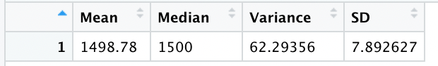
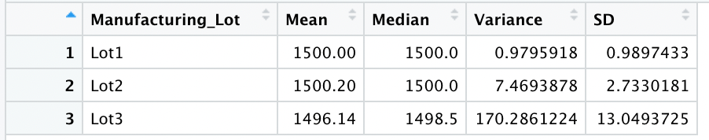
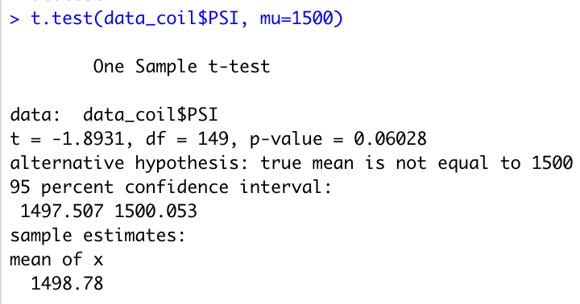
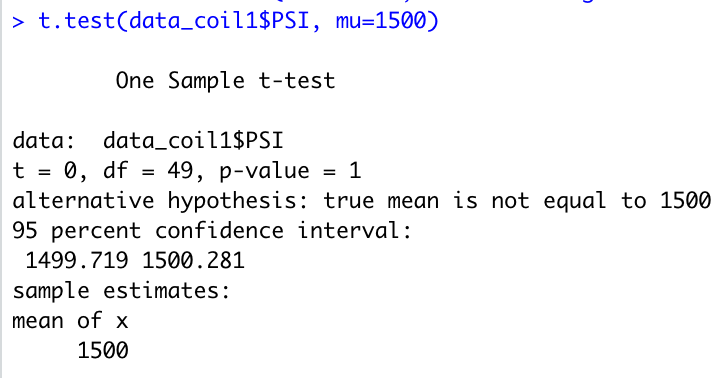
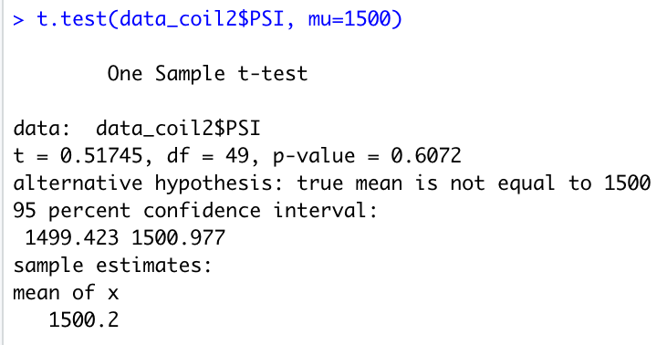
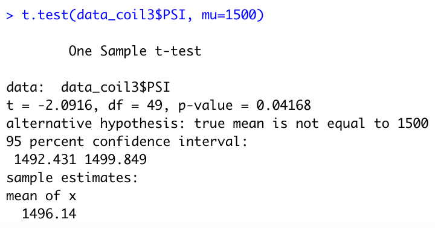

# MechaCar Statistical Analysis

## Linear Regression to Predict MPG
For this analysis a linear regression model was built in R, to predict gas mileage (mpg) based on other measurements of the MechaCar vehicle prototypes. The predictor variables include vehicle length, vehicle weight, spoiler angle, ground clearance, and whether or not they are all wheel drive.

The model is highly predictive of mpg in this dataset, accounting for 71% of the variance, giving a p-value of 5x10-11. 

- Among the individual predictors, there are 2 highly significant contributors, vehicle length (p=2.6x10-12), and ground clearance (p=5.2x10-8). For both variables, higher values are predictive of higher gas mileage. 

- The slope is not zero. The null hypothesis which is tested in linear regression is that the slope is 0. In this case, a p-value of 5x10-11 indicates that we should certainly reject the null hypothesis. 

- The predictive value of this model is highly statistically significant. It explains a high percentage of the variance.

## Summary Statistics on Suspension Coils
Summary statistics wre calculated for PSI for the suspension coils used by MechaCar. 
With all data included, the results are:

Next we divided the data according to manufacturing lot and created summary statistics for each lot individually.

While mean and median PSI measurements are the same across the three lots, there is far more variability within the measurements in lot 3, resulting in much higher variance and standard deviation. 
Overall the data meet MechaCar design specifications regarding variance in PSI. However, a closer look grouped by manufacturing lot indicates a problem specifically with lot 3. 

## T-Tests on Suspension Coils
To test for difference from the population mean of 1500psi, there are 4 t-tests. Given that we have no a priori hypothesis that any difference would be on one side or other of the distribution, we will use a 2-tailed t-test, with $\alpha$ set to 0.05 as would be standard for single tests. 

For the three lots in question combined:

A mean of 1498.78 is slightly below 1500 psi, but the upper bound of the 95% Confidence Interval crosses 1500, at 1500.053. Thus the p-value is 0.06, and the difference is no statistically significant given $\alpha$=0.05.

For Lot 1:

The mean is exactly 1500, matching the population mean.

For Lot 2:

The mean is 1500.2. The population mean of 1500 falls within the 95% Confidence Interval, and the difference is not statistically significant (p=0.6).

For Lot 3:

The mean is 1496.14. The upper bound of the 95% CI is 1499.85. Thus the true population mean of 1500 is not included. The p-value is 0.04, and we consider the measure of PSI in specifically Lot 3 to be statistically different from the expected mean of 1500. 

## Study Design: MechaCar vs. Competition
Gas mileage is a concern for many new car buyers. It would be valuable to compare the performance of MechaCar's models against that of a competitor's. However, car companies tend to have a wide range of models from subcompact cars up to large SUVs where different vehicles in the same class from different companies will have more in common with each other than with vehicles in different classes within their own company. This will make it harder to identify statistically significant differences that are meaningful to consumers. 
An interesting observation from our first analysis is that all-wheel-drive capability was not a predictor of gas mileage. Typically cars/SUVs which are have all-wheel drive or 4-wheel drive have poorer gas mileage than 2-wheel drive vehicles. It would be interesting to see how gas mileage of MechaCar's vehicles in this group compare to those of other makers. If they have an advantage over other makers in this segment of the market they could easily market that difference to consumers.

- The null hypothesis is that there are no differences in mean gas mileage (mpg) for AWD vehicles between different carmakers.

- Our alternative hypothesis is that the group mean of mpg in MechaCar's AWD vehicles is higher than that of some or all of its competitors. 

- For this test, we will have 3 or more groups since there is more than one competitor. Therefore we will need a One-Way ANOVA to compare to test for differences in group means. If the p-value for the test is less than 0.05, then Tukey's post-hoc test will be used to look for which group differences are significant. 

- We would need gas mileage data on all vehicles with AWD capability from multiple competing carmakers.

